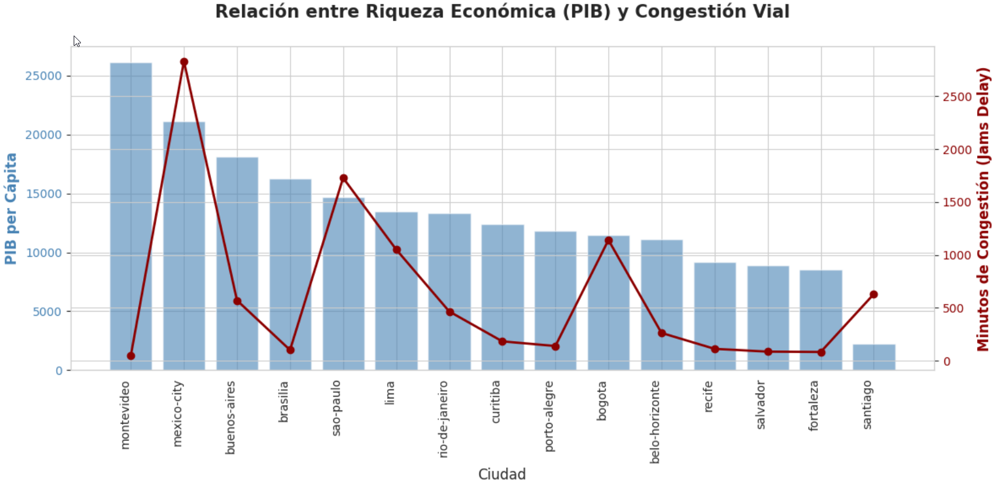
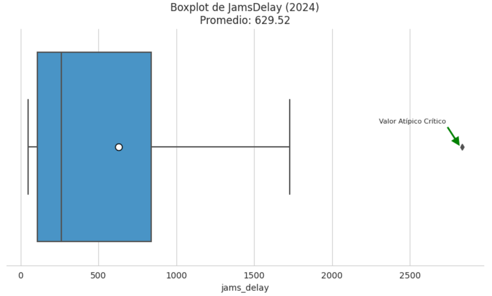
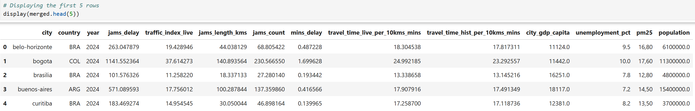

# Urban Mobility & Economic Productivity Analysis (2024)

This project analyzes the relationship between traffic congestion (TomTom Index) and GDP per capita (OECD) to identify infrastructure investment priorities.

### 🛠️ Technical Stack
* **Language:** Python
* **Libraries:** Pandas, Seaborn, Matplotlib
* **Key Skills:** Data Wrangling, Outlier Analysis, Multi-source Integration.

## 📊 Visual Insights

### 1. Wealth vs. Traffic Congestion
Analysis of how economic output relates to urban mobility.

### 2. Distribution and Outlier Detection
Identifying cities with critical delays.

## 🗂️ Data Integration Preview

## 🚀 Key Conclusions
* **Mexico City:** Identified as a high-priority outlier for infrastructure ROI.
* **Structural Planning:** Wealth alone does not solve congestion; urban planning is key.
